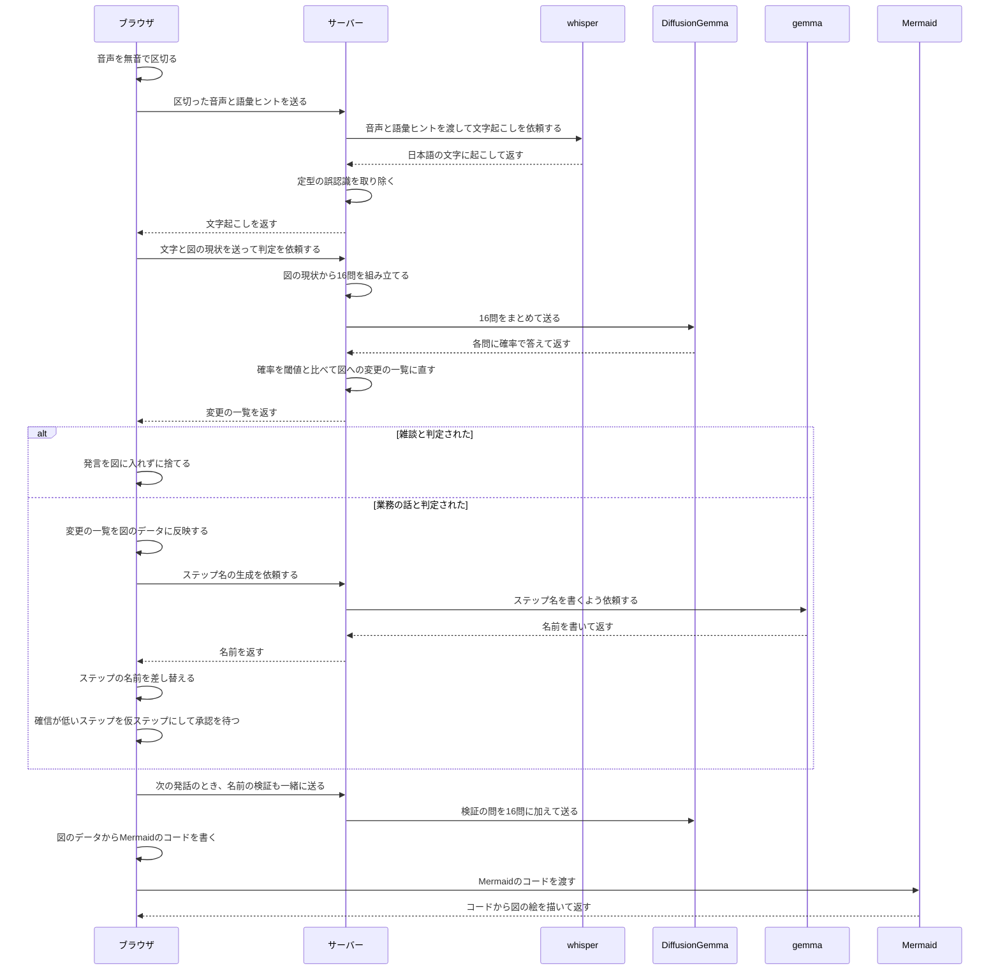

# 参照用: 「発話が図になるまで」の正解フロー

開発用サンプルの題材「このアプリの仕組み」で**本来出てほしい**業務フロー図。
実装を読んで起こしたもので、生成結果を突き合わせる基準に使う。

各ステップの末尾に実装上の位置を書いてある（`ファイル:行`）。

## シーケンス図

## 根拠（実装上の位置）

| # | ステップ | 実装 |
|---|---|---|
| 1 | ブラウザ: 音声を無音で区切る | `lib/audio/vad.ts`（RMS ベースの発話区間検出）|
| 2 | ブラウザ → サーバー: 音声と語彙ヒント | `app/components/mic-transcriber.tsx:183` `POST /api/transcribe`（`audio` と `vocab`）|
| 3 | サーバー → whisper | `app/api/transcribe/route.ts:69` `${WHISPER_BASE_URL}/inference`（`vocab` は `prompt` として渡す）|
| 4 | whisper → サーバー: 返す | 同上の応答 |
| 5 | サーバー: 誤認識を取り除く | `app/api/transcribe/route.ts` の `cleanJapanese()` |
| 6 | サーバー → ブラウザ: 返す | 同 route の `Response.json` |
| 7 | ブラウザ → サーバー: 判定を依頼 | `app/components/use-pipeline.ts` `POST /api/analyze`（`utterance` / `model` / `recent` / `verify`）|
| 8 | サーバー: 16問を組み立てる | `app/api/analyze/route.ts:65` `buildUtteranceQuestions()` |
| 9 | サーバー → DiffusionGemma | `lib/jev.ts` の `postJev` → `lib/jev-local.ts` の `postLocal` |
| 10 | DiffusionGemma → サーバー: 返す | 同上の応答 |
| 11 | サーバー: 閾値と比べる | `app/api/analyze/route.ts:69` `interpret()`（閾値は `lib/analysis/thresholds.ts`）|
| 12 | サーバー → ブラウザ: 変更の一覧 | `app/api/analyze/route.ts:74` `{ interpretation, exchange }` |
| 13 | ブラウザ: 反映する | `app/components/use-pipeline.ts:124` `applyOps()` |
| 14 | ブラウザ → サーバー → gemma: 名前の生成 | `use-pipeline.ts:149` `POST /api/label` → `lib/analysis/label.ts` → `lib/llm.ts`（`LLAMA_BASE_URL`）|
| 15 | ブラウザ: 名前を差し替える | `use-pipeline.ts` の `buildLabelOps()` → `commitOps()` |
| 16 | 次の発話で検証 | `use-pipeline.ts` が `verify` に載せ、`lib/analysis/verify.ts` が問に変える |
| 17 | ブラウザ: Mermaid のコードを書く | `app/components/diagram-pane.tsx:39` `toMermaid(model)` |
| 18 | Mermaid → ブラウザ: 絵を返す | `app/components/mermaid-diagram.tsx` （`mermaid.render`）|

## 生成結果と比べるときの注意

- **gemma を呼ぶのはサーバーで、ブラウザではない。** ブラウザ → サーバー → gemma → サーバー → ブラウザ の 4 本で 1 往復になる
- **閾値との比較はサーバー側**（`/api/analyze` の中）。ブラウザは受け取った変更を適用するだけ
- **`alt` は「雑談 / 業務の話」の 1 箇所だけ。** 閾値比較や名前の生成は必ず通る道で、分岐ではない
